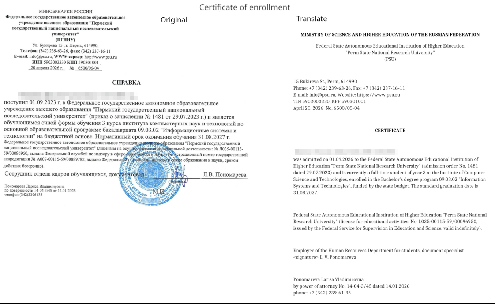
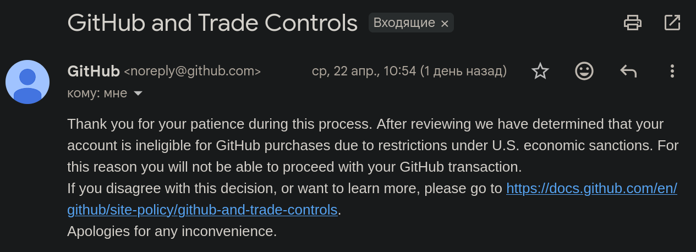
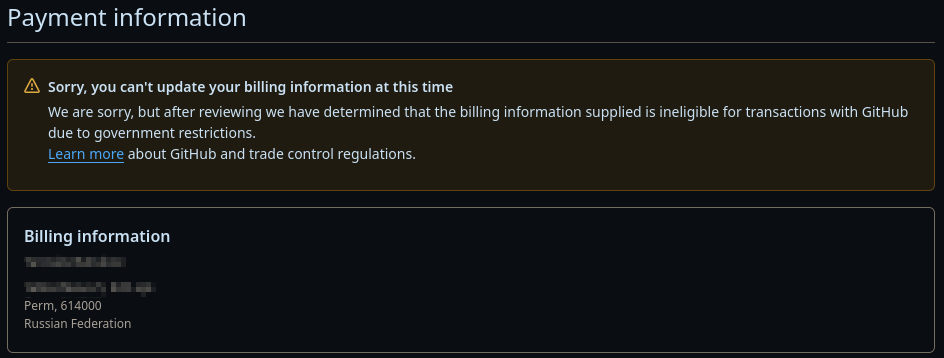
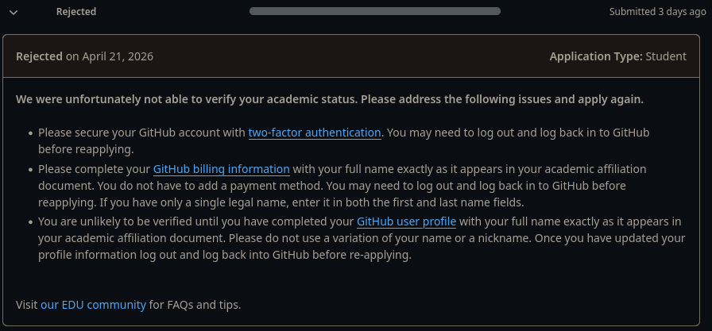
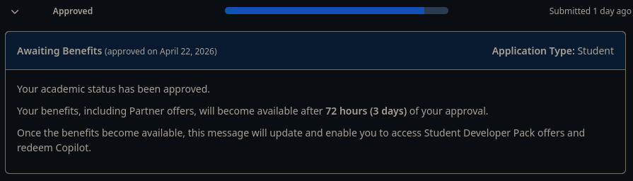

# Получение GitHub Student Pack

1. Получить почту на домене универа. Обращаться за этим на internet@psu.ru
2. Прикрепляем эту почту к своему аккаунту на GitHub
3. Получить справку об обучении, попросив прислать копию на почту
4. Сделать перевод полученного документа

5. Добавить двухфакторную аунтефикацию
Settings -> Password and authentication

6. Заполнить данные оплаты (только обязательные поля)
	Settings -> Billing and licensing -> Payment Information
	Поля:
	- Имя
	- Фамилия
	- Адрес
	- Город
	- Почтовый код (614000 для Перми)
	- Страна
	Отправляем на проверку. В течении 1-2 дней придет отказ из-за санкций:
	
	
	Так и должно быть. Перезаходим в аккаунт. Проверям, закреплена ли информация. Должно выглядеть так:
	

Если эти данные не заполнить, то придет отказ:

7. Заполеням форму заявления
	Settings -> Billing and licensing -> Educations Benefits
	Запускаем приложение (Start an application)
	- Выбираем пункт Student
	- Вводим название универа -> Perm State National Research University
	- Выбираем прикрепленную университетскую почту
	После этого нужно подлиться местоположением. **Обязательно отключить proxy/vpn.**
	- Тыкаем далее и в выпадающим списке выбираем "Неофициальный датированный перевод"
	- Прикрпеляем файл оригинала и перевода
		`Данная форма принимает только 1 файл до 1мб`
	- Отправляем на проверку

После требуется только переодически проверять статус.
В течении 1-2 дней статус измениться. Если все удачно, то появится сообщение:
